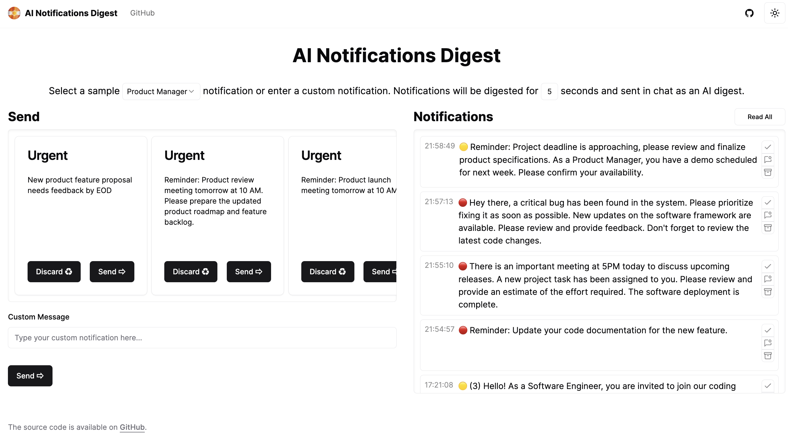

# AI Notification Digest

This is a [Novu](https://novu.co/) project bootstrapped with [`create-novu-app`](https://www.npmjs.com/package/create-novu-app).



## Getting Started

Start the Novu Dev Studio:

```bash
npx novu@latest dev
```

Then, run the development server:

```bash
npm run dev
# or
yarn dev
# or
pnpm dev
# or
bun dev
```

Open [http://localhost:4000](http://localhost:4000) in your browser to view the application.

## Learn More

To learn more about Novu, take a look at the following resources:

- [Novu Documentation](https://docs.novu.co/) - learn about Novu features and API.
- [Novu Quickstarts](https://docs.novu.co/quickstarts/overview) - an interactive Novu tutorial.

You can check out [the Novu GitHub repository](https://github.com/novuhq/novu) - your feedback and contributions are welcome!

## Deploy on Vercel

The easiest way to deploy your Next.js app is to use the [Vercel Platform](https://vercel.com/new?utm_medium=default-template&filter=next.js&utm_source=create-novu-app&utm_campaign=create-novu-app-readme) from the creators of Next.js.

Check out our [Next.js deployment documentation](https://nextjs.org/docs/deployment) for more details.
